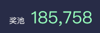
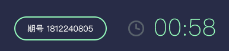
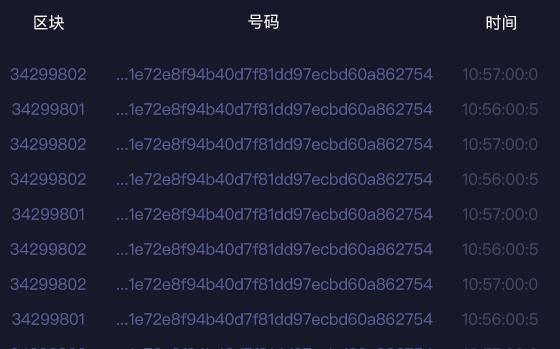
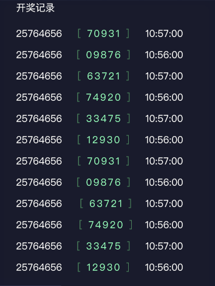
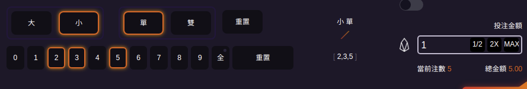
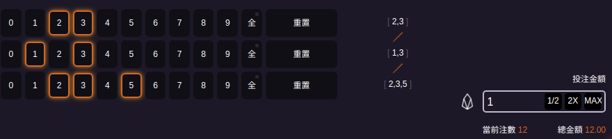
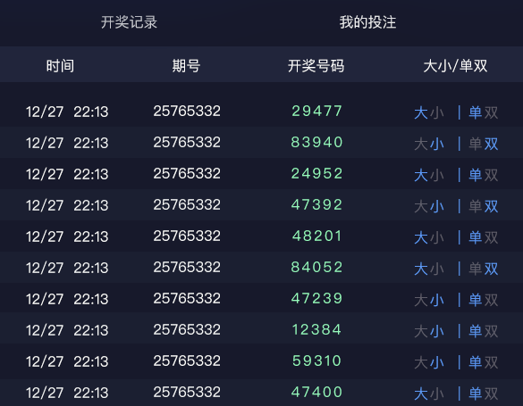
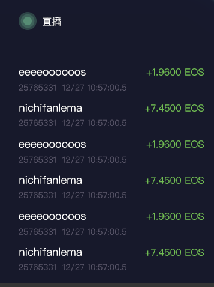

# cryptogame 游戏前端功能+API简单说明

ChangeLog:
  
  - 更新投组组合


1. 登录


   
利用scatter插件钱包 实现登录 参考[demo](http://developer.mathwallet.org/sample01/)

2. 奖池余额



demo代码返回结果是`185758.12000 EOS`， 前端显示只整数部分`185758`
```js
var settings = {
  "async": true,
  "crossDomain": true,
  "url": "https://proxy.eosnode.tools/v1/chain/get_currency_balance",
  "method": "POST",
  "headers": {
    "Content-Type": "application/json",
  },
  "processData": false,
  "data": "{\"code\":\"eosio.token\", \"account\":\"cryptogame12\",\"symbol\":\"EOS\"}"
}

$.ajax(settings).done(function (response) {
  console.log(response);
});
```
3. TIME倒计时



显示距离下一整点分钟的倒计时， 比如当前时间是`14:13:21`, 那前端显示`00:39`

4. ROLLING BLOCK




信息提自 websocket消息的type0

WS地址: ``wss://dappswin.io/api/ws``

```json
[{"type":0,"data":{"id":"01aec35a24c58a581bcd3b026becbacc1ec4fb4a1b198ceec4d99a381dec8f21","num":28230490,"time":1542035428500}}]
```

 - id 放在 ``号码`` 上，
 - num放在``区块``， 
 - time是timestamp的毫秒格式，前端只显示 23:10:28:5

4. 左上角的开奖记录


   
   根据ws消息的type3里的gameid 显示

   ```json
   [{"type":3,"blocknum":28231644,"id":"01aec7dcce9b993e00e0fcad5e3a9e7ad546c9ef46b449b5f626eddc66f00f17","time":1542035428000,"data":{"gameid":15877,"result":286171}}]
   ```


5. 投注限额 进度条
   


   最大长度显示总余额的（第二步返回的结果）的5%
   当前进度是 当前分钟里 ws消息里的 type1的 quantity":"10.0000 EOS"的总和

6.  投注组合

    主要通过交易里的memo信息，后台负责解析并判定输赢

    大: `b`, 小: `s`, 单：`o`, 双：`e`
    数字是是用中括号括起来 `[1]`

    

    上图发起交易时，memo字段里放置 `lottery:s,o,[235]`， 此图是1星的玩法，前端显示当前注数时是累加的， 点中一个，累加一次，所以是5注，达标有5种中奖可能性


    

    上图发起交易时，memo的字段填写成 `lottery:[23][13][235]`, 此图是3星玩法，前端显示注数时，是2×2×3=12得到的。共12注，代表有12种中奖可能性

    如何发起交易 可参考[demo](http://developer.mathwallet.org/sample01/)里的`转账`部分


  ~~- 注意：~~

  ~~如果是被邀请进来的玩家，memo字段需要统一加上从Cookies里Get的邀请人信息 ``lottery:[23][13][235]@haztknzxhege``~~

  ~~邀请人信息是官网的前端通过用户访问类似链接 `https://dappswin.io/link/haztknzxhege`， 自行记录到Cookies的。~~


7. Records 开奖结果



    显示 ws消息里的type3

    从左到右分别取 .time所在的分钟值 data.gameid, data.result

8. LIVE


   
   由ws消息里的type101,102,111,112构成，显示的是全网用户押注和收益的信息

   - 如果是type101 为EOS押注消息，从左到右以此取 data.from, data.quantity .time(精确到0.5秒)
   - 如果是type102 为EOS收益消息,从左到右以此取 data.to, data.amount, .time(精确到0.5秒)
   - 如果是type111 为CGG押注消息,从左到右以此取 data.from, data.amount, .time(精确到0.5秒)
   - 如果是type112 为CGG收益消息,从左到右以此取 data.to, data.amount, .time(精确到0.5秒)
